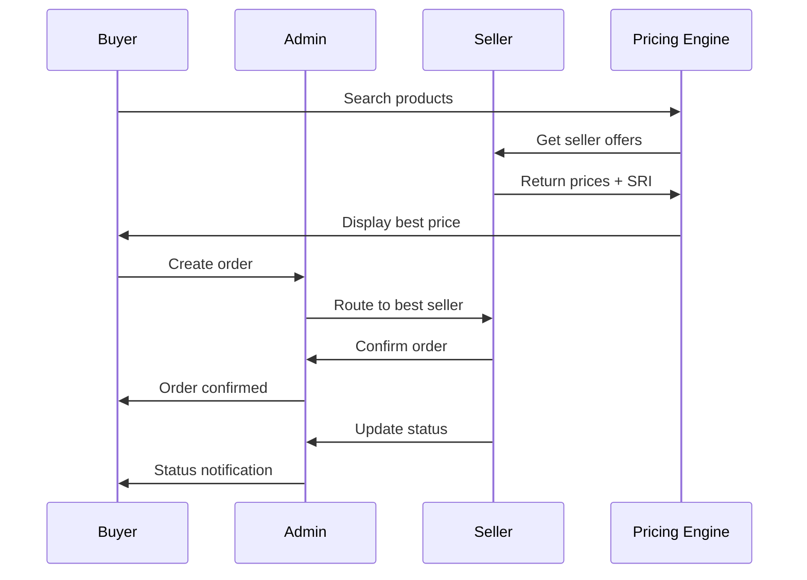

# 🔗 Buyer-Admin-Seller Integration Plan

**Date:** October 20, 2025  
**Purpose:** Define communication flows between Buyer, Admin, and Seller modules

---

## 🏗️ **System Architecture Overview**

```
┌─────────────────┐    ┌─────────────────┐    ┌─────────────────┐
│   BUYER MODULE  │    │   ADMIN MODULE  │    │  SELLER MODULE  │
│                 │    │                 │    │                 │
│ • Individual    │◄──►│ • SRI Monitoring│◄──►│ • Inventory     │
│ • Enterprise    │    │ • Disputes      │    │ • Orders        │
│ • Orders        │    │ • Financial     │    │ • Pricing       │
│ • Analytics     │    │ • Compliance    │    │ • Performance  │
└─────────────────┘    └─────────────────┘    └─────────────────┘
```

---

## 🔄 **Key Integration Flows**

### **1. Order Processing Flow**



### **2. SRI Monitoring Integration**

```typescript
// Admin monitors seller SRI scores
interface SRIMonitoring {
  sellerId: string;
  currentSRI: number;
  threshold: number;
  isEligible: boolean;
  lastUpdated: Date;
}

// When SRI drops below threshold
interface SRIAlert {
  sellerId: string;
  oldScore: number;
  newScore: number;
  threshold: number;
  alertType: 'CRITICAL' | 'WARNING';
  actionRequired: 'SUSPEND' | 'MONITOR';
}

// Admin actions
interface AdminAction {
  sellerId: string;
  action: 'SUSPEND' | 'RESTORE' | 'WARNING';
  reason: string;
  adminId: string;
  timestamp: Date;
}
```

### **3. Dynamic Pricing Algorithm**

```typescript
// Pricing calculation service
class PricingService {
  async calculateDisplayPrice(masterProductId: string): Promise<PricingResult> {
    // 1. Get all seller offers for product
    const offers = await this.getSellerOffers(masterProductId);
    
    // 2. Filter by SRI threshold (>=70)
    const eligibleOffers = offers.filter(offer => offer.sriScore >= 70);
    
    // 3. Find lowest price
    const lowestPrice = Math.min(...eligibleOffers.map(o => o.price));
    
    // 4. Apply commission rate
    const commissionRate = await this.getCommissionRate(masterProductId);
    const displayPrice = lowestPrice + (lowestPrice * commissionRate);
    
    // 5. Select seller (lowest price, highest SRI if tied)
    const selectedSeller = this.selectBestSeller(eligibleOffers);
    
    return {
      displayPrice,
      sellerPrice: lowestPrice,
      commission: displayPrice - lowestPrice,
      selectedSeller,
      exchangeRate: await this.getCurrentExchangeRate()
    };
  }
}
```

### **4. Dispute Resolution Flow**

```typescript
// Buyer initiates dispute
interface DisputeCreation {
  orderId: string;
  buyerId: string;
  disputeType: 'WRONG_ITEM' | 'DAMAGED' | 'NOT_DELIVERED' | 'DEFECTIVE';
  description: string;
  evidenceUrls: string[];
}

// Admin reviews and resolves
interface DisputeResolution {
  disputeId: string;
  adminId: string;
  resolution: 'BUYER_FAVOR' | 'SELLER_FAVOR' | 'NO_FAULT';
  sriImpact: number; // Points to deduct from seller SRI
  refundAmount?: number;
  resolutionNotes: string;
}

// SRI impact calculation
interface SRIImpact {
  sellerId: string;
  disputeType: string;
  resolution: string;
  pointsDeducted: number;
  newSRI: number;
}
```

---

## 📊 **Data Synchronization**

### **Real-time Updates**

```typescript
// WebSocket events for real-time updates
interface WebSocketEvents {
  // Order status updates
  'order.status.changed': {
    orderId: string;
    newStatus: string;
    timestamp: Date;
  };
  
  // SRI score updates
  'seller.sri.updated': {
    sellerId: string;
    newScore: number;
    previousScore: number;
  };
  
  // Stock level changes
  'inventory.stock.changed': {
    productId: string;
    sellerId: string;
    newStock: number;
    previousStock: number;
  };
  
  // Price updates
  'pricing.updated': {
    productId: string;
    newDisplayPrice: number;
    sellerId: string;
  };
}
```

### **Scheduled Synchronization**

```typescript
// Daily SRI calculation
interface SRICalculation {
  sellerId: string;
  period: 'DAILY' | 'WEEKLY' | 'MONTHLY';
  metrics: {
    fulfillmentRate: number;
    deliveryRate: number;
    defectRate: number;
    complianceRate: number;
  };
  calculatedSRI: number;
  previousSRI: number;
  change: number;
}

// Financial reconciliation
interface FinancialReconciliation {
  date: Date;
  totalOrders: number;
  totalRevenue: number;
  totalCommissions: number;
  sellerPayouts: SellerPayout[];
  discrepancies: FinancialDiscrepancy[];
}
```

---

## 🔐 **Security & Access Control**

### **Cross-Module Authentication**

```typescript
// JWT token structure for cross-module communication
interface CrossModuleToken {
  userId: string;
  module: 'BUYER' | 'SELLER' | 'ADMIN';
  role: string;
  permissions: string[];
  expiresAt: Date;
  issuedAt: Date;
}

// API Gateway routing
interface APIRouting {
  '/api/buyer/*': 'BUYER_MODULE';
  '/api/seller/*': 'SELLER_MODULE';
  '/api/admin/*': 'ADMIN_MODULE';
  '/api/shared/*': 'SHARED_SERVICES';
}
```

### **Data Isolation**

```typescript
// Buyer data isolation
interface BuyerDataIsolation {
  buyerId: string;
  accessibleData: {
    ownOrders: boolean;
    ownProfile: boolean;
    sellerPublicInfo: boolean;
    adminPublicInfo: boolean;
  };
  restrictions: {
    cannotViewOtherBuyers: boolean;
    cannotViewSellerPrivateData: boolean;
    cannotViewAdminSensitiveData: boolean;
  };
}
```

---

## 📈 **Performance Optimization**

### **Caching Strategy**

```typescript
// Redis cache keys
interface CacheKeys {
  // Product pricing cache
  'pricing:product:{productId}': PricingResult;
  
  // Seller SRI cache
  'sri:seller:{sellerId}': SRIScore;
  
  // Exchange rate cache
  'exchange:rate:USD_ZWL': ExchangeRate;
  
  // Inventory cache
  'inventory:product:{productId}': InventoryData;
}

// Cache invalidation triggers
interface CacheInvalidation {
  'seller.sri.updated': ['sri:seller:*', 'pricing:product:*'];
  'inventory.stock.changed': ['inventory:product:*', 'pricing:product:*'];
  'pricing.updated': ['pricing:product:*'];
}
```

### **Database Optimization**

```sql
-- Indexes for cross-module queries
CREATE INDEX idx_orders_buyer_seller ON orders(buyer_id, seller_id);
CREATE INDEX idx_orders_status_created ON orders(status, created_at);
CREATE INDEX idx_sri_seller_score ON seller_sri_scores(seller_id, score);
CREATE INDEX idx_inventory_product_seller ON seller_inventory(master_product_id, seller_id);

-- Partitioning for large tables
CREATE TABLE orders_2025 PARTITION OF orders
FOR VALUES FROM ('2025-01-01') TO ('2026-01-01');
```

---

## 🚨 **Error Handling & Monitoring**

### **Cross-Module Error Handling**

```typescript
// Error propagation between modules
interface ModuleError {
  source: 'BUYER' | 'SELLER' | 'ADMIN';
  target: 'BUYER' | 'SELLER' | 'ADMIN';
  errorType: 'VALIDATION' | 'BUSINESS_LOGIC' | 'SYSTEM';
  errorCode: string;
  message: string;
  context: Record<string, any>;
  timestamp: Date;
}

// Error recovery strategies
interface ErrorRecovery {
  'pricing.service.down': 'use_cached_prices';
  'sri.service.down': 'use_last_known_sri';
  'inventory.service.down': 'disable_stock_checks';
  'payment.service.down': 'queue_for_retry';
}
```

### **Monitoring & Alerting**

```typescript
// System health monitoring
interface SystemHealth {
  module: string;
  status: 'HEALTHY' | 'DEGRADED' | 'DOWN';
  metrics: {
    responseTime: number;
    errorRate: number;
    throughput: number;
  };
  alerts: Alert[];
}

// Critical alerts
interface CriticalAlerts {
  'SRI_VIOLATION': {
    sellerId: string;
    sriScore: number;
    threshold: number;
    action: 'SUSPEND_SELLER';
  };
  'PAYMENT_FAILURE': {
    orderId: string;
    amount: number;
    retryCount: number;
    action: 'NOTIFY_ADMIN';
  };
  'INVENTORY_MISMATCH': {
    productId: string;
    sellerId: string;
    reportedStock: number;
    actualStock: number;
    action: 'INVESTIGATE';
  };
}
```

---

## 🧪 **Testing Strategy**

### **Integration Testing**

```typescript
// End-to-end test scenarios
interface IntegrationTests {
  'order_flow_complete': {
    description: 'Buyer places order, seller processes, admin monitors';
    steps: [
      'Buyer searches product',
      'Buyer places order',
      'Seller receives notification',
      'Seller processes order',
      'Admin monitors SRI impact',
      'Order delivered successfully'
    ];
  };
  
  'dispute_resolution': {
    description: 'Buyer disputes order, admin resolves, SRI updated';
    steps: [
      'Buyer initiates dispute',
      'Admin reviews evidence',
      'Admin makes resolution',
      'Seller SRI updated',
      'Buyer notified of resolution'
    ];
  };
}
```

### **Performance Testing**

```typescript
// Load testing scenarios
interface LoadTests {
  'concurrent_orders': {
    description: '1000 concurrent orders';
    expectedResponseTime: '<2 seconds';
    expectedSuccessRate: '>99%';
  };
  
  'pricing_calculation': {
    description: 'Dynamic pricing for 10000 products';
    expectedResponseTime: '<100ms';
    expectedAccuracy: '100%';
  };
}
```

---

## 📋 **Implementation Checklist**

### **Phase 1: Core Integration (Week 1)**
- [ ] Set up cross-module authentication
- [ ] Implement basic order flow
- [ ] Create shared database schemas
- [ ] Set up API Gateway routing

### **Phase 2: Advanced Features (Week 2)**
- [ ] Implement dynamic pricing algorithm
- [ ] Set up SRI monitoring
- [ ] Create dispute resolution flow
- [ ] Implement real-time notifications

### **Phase 3: Optimization (Week 3)**
- [ ] Set up caching layer
- [ ] Implement performance monitoring
- [ ] Create error handling system
- [ ] Set up automated testing

### **Phase 4: Production (Week 4)**
- [ ] Deploy to staging environment
- [ ] Run integration tests
- [ ] Performance testing
- [ ] Security audit
- [ ] Production deployment

---

**🎯 Next Steps:**
1. Review integration plan with team
2. Set up development environment
3. Begin Phase 1 implementation
4. Establish monitoring and alerting
