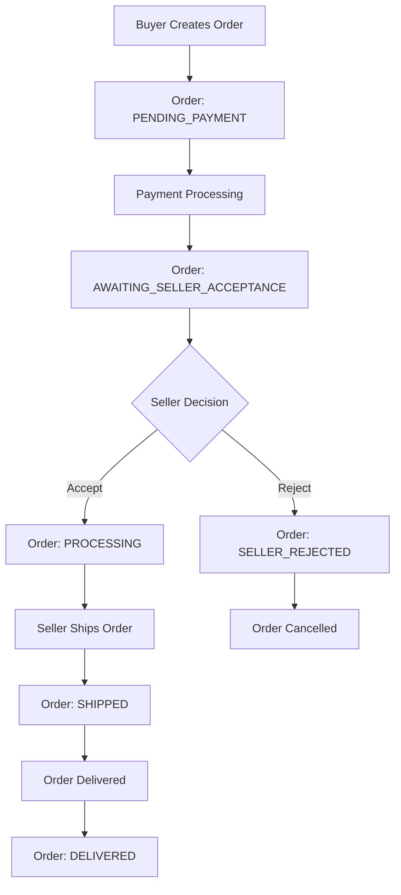

# Frontend Buyer Implementation Guide

## Overview
This guide provides comprehensive instructions for implementing the buyer-side frontend for the Simbi Marketplace, focusing on individual buyers and their interaction with sellers through the order system.

## Table of Contents
1. [Authentication Flow](#authentication-flow)
2. [Product Search & Discovery](#product-search--discovery)
3. [Order Management](#order-management)
4. [Address Management](#address-management)
5. [Analytics & Dashboard](#analytics--dashboard)
6. [Buyer-Seller Order Flow](#buyer-seller-order-flow)
7. [Error Handling](#error-handling)
8. [State Management](#state-management)

---

## Authentication Flow

### 1. Buyer Registration
```typescript
interface BuyerRegistration {
  email: string;
  password: string;
  firstName: string;
  lastName: string;
  buyerType: 'INDIVIDUAL' | 'ENTERPRISE';
  phoneNumber: string;
  address: {
    addressLine1: string;
    city: string;
    province: string;
    postalCode: string;
    country: string;
  };
}

// API Call
POST /api/buyer/auth/register
Content-Type: application/json

{
  "email": "buyer@example.com",
  "password": "Password123!",
  "firstName": "John",
  "lastName": "Doe",
  "buyerType": "INDIVIDUAL",
  "phoneNumber": "+263771234567",
  "address": {
    "addressLine1": "123 Main St",
    "city": "Harare",
    "province": "Harare",
    "postalCode": "263",
    "country": "Zimbabwe"
  }
}
```

### 2. Buyer Login
```typescript
interface LoginRequest {
  email: string;
  password: string;
}

// API Call
POST /api/buyer/auth/login
Content-Type: application/json

{
  "email": "buyer@example.com",
  "password": "Password123!"
}

// Response
{
  "success": true,
  "data": {
    "accessToken": "eyJhbGciOiJIUzI1NiIsInR5cCI6IkpXVCJ9...",
    "refreshToken": "eyJhbGciOiJIUzI1NiIsInR5cCI6IkpXVCJ9...",
    "buyer": {
      "id": "buyer-uuid",
      "email": "buyer@example.com",
      "firstName": "John",
      "lastName": "Doe",
      "buyerType": "INDIVIDUAL"
    }
  }
}
```

### 3. Token Management
```typescript
// Store tokens securely
localStorage.setItem('buyer_token', response.data.accessToken);
localStorage.setItem('buyer_refresh', response.data.refreshToken);

// Add to all API requests
const headers = {
  'Authorization': `Bearer ${localStorage.getItem('buyer_token')}`,
  'Content-Type': 'application/json'
};
```

---

## Product Search & Discovery

### 1. Search Products
```typescript
interface ProductSearchParams {
  q?: string;           // Search query
  category?: string;    // Product category
  manufacturer?: string; // Manufacturer filter
  minPrice?: number;    // Minimum price
  maxPrice?: number;    // Maximum price
  page?: number;        // Page number
  limit?: number;       // Items per page
}

// API Call
GET /api/buyer/products/search?q=brake&category=brakes&minPrice=50&maxPrice=500&page=1&limit=20
Authorization: Bearer <token>

// Response
{
  "success": true,
  "data": {
    "products": [
      {
        "id": "product-uuid",
        "name": "Brake Pad Set",
        "oemPartNumber": "BP-12345",
        "manufacturer": "Brembo",
        "description": "High-performance brake pads",
        "sellerPrice": 89.99,
        "displayPrice": 101.99,
        "commission": 12.00,
        "quantity": 15,
        "seller": {
          "id": "seller-uuid",
          "businessName": "Auto Parts Ltd",
          "sriScore": 85
        },
        "vehicleCompatibility": {
          "make": "Toyota",
          "model": "Camry",
          "year": "2020"
        },
        "imageUrls": ["https://example.com/image1.jpg"]
      }
    ],
    "pagination": {
      "page": 1,
      "limit": 20,
      "total": 150,
      "totalPages": 8
    }
  }
}
```

### 2. Get All Products
```typescript
// API Call
GET /api/buyer/products?page=1&limit=20&category=brakes
Authorization: Bearer <token>
```

### 3. Get Product by ID
```typescript
// API Call
GET /api/buyer/products/{productId}
Authorization: Bearer <token>

// Response
{
  "success": true,
  "data": {
    "id": "product-uuid",
    "name": "Brake Pad Set",
    "oemPartNumber": "BP-12345",
    "manufacturer": "Brembo",
    "description": "High-performance brake pads",
    "sellerPrice": 89.99,
    "displayPrice": 101.99,
    "commission": 12.00,
    "quantity": 15,
    "seller": {
      "id": "seller-uuid",
      "businessName": "Auto Parts Ltd",
      "sriScore": 85
    },
    "vehicleCompatibility": {
      "make": "Toyota",
      "model": "Camry",
      "year": "2020"
    },
    "imageUrls": ["https://example.com/image1.jpg"]
  }
}
```

### 4. VIN Decode
```typescript
interface VinDecodeRequest {
  vin: string;
}

// API Call
POST /api/buyer/products/vin-decode
Authorization: Bearer <token>
Content-Type: application/json

{
  "vin": "1HGBH41JXMN109186"
}

// Response
{
  "success": true,
  "data": {
    "vin": "1HGBH41JXMN109186",
    "make": "Honda",
    "model": "Civic",
    "year": "2021",
    "engine": "1.5L Turbo",
    "compatibleProducts": [
      {
        "id": "product-uuid",
        "name": "Oil Filter",
        "oemPartNumber": "OF-12345",
        "displayPrice": 15.99
      }
    ]
  }
}
```

---

## Order Management

### 1. Create Order (Simplified)
```typescript
interface CreateOrderRequest {
  items: {
    productId: string;  // Product ID from search results
    quantity: number;
  }[];
  shippingAddressId: string;  // Address ID from user's addresses
  poNumber?: string;          // Optional purchase order number
  costCenter?: string;        // Optional cost center
  notes?: string;             // Optional notes
}

// API Call
POST /api/buyer/orders
Authorization: Bearer <token>
Content-Type: application/json

{
  "items": [
    {
      "productId": "product-uuid-1",
      "quantity": 2
    },
    {
      "productId": "product-uuid-2", 
      "quantity": 1
    }
  ],
  "shippingAddressId": "address-uuid",
  "poNumber": "PO-2024-001",
  "notes": "Please handle with care"
}

// Response
{
  "success": true,
  "message": "Order created successfully with 2 seller order(s)",
  "data": {
    "id": "order-uuid",
    "orderNumber": "ORD-1761035614146-XNL6UL",
    "buyerId": "buyer-uuid",
    "sellerId": "seller-uuid",
    "status": "PENDING_PAYMENT",
    "totalAmount": 203.98,
    "currency": "USD",
    "createdAt": "2024-01-15T10:30:00Z"
  }
}
```

### 2. Get Buyer Orders
```typescript
// API Call
GET /api/buyer/orders?page=1&limit=20&status=PROCESSING
Authorization: Bearer <token>

// Response
{
  "success": true,
  "data": {
    "orders": [
      {
        "id": "order-uuid",
        "orderNumber": "ORD-1761035614146-XNL6UL",
        "seller": {
          "id": "seller-uuid",
          "businessName": "Auto Parts Ltd"
        },
        "status": "PROCESSING",
        "totalAmount": 203.98,
        "currency": "USD",
        "createdAt": "2024-01-15T10:30:00Z",
        "items": [
          {
            "id": "item-uuid",
            "productName": "Brake Pad Set",
            "quantity": 2,
            "unitPrice": 89.99,
            "displayPrice": 101.99
          }
        ]
      }
    ],
    "pagination": {
      "page": 1,
      "limit": 20,
      "total": 5,
      "totalPages": 1
    }
  }
}
```

### 3. Get Order Details
```typescript
// API Call
GET /api/buyer/orders/{orderId}
Authorization: Bearer <token>

// Response
{
  "success": true,
  "data": {
    "id": "order-uuid",
    "orderNumber": "ORD-1761035614146-XNL6UL",
    "buyer": {
      "id": "buyer-uuid",
      "firstName": "John",
      "lastName": "Doe",
      "email": "buyer@example.com"
    },
    "seller": {
      "id": "seller-uuid",
      "businessName": "Auto Parts Ltd",
      "email": "seller@autoparts.com"
    },
    "shippingAddress": {
      "id": "address-uuid",
      "fullName": "John Doe",
      "addressLine1": "123 Main St",
      "city": "Harare",
      "province": "Harare",
      "postalCode": "263"
    },
    "status": "PROCESSING",
    "paymentStatus": "PENDING",
    "subtotal": 179.98,
    "shippingCost": 0,
    "platformCommission": 24.00,
    "totalAmount": 203.98,
    "currency": "USD",
    "poNumber": "PO-2024-001",
    "notes": "Please handle with care",
    "createdAt": "2024-01-15T10:30:00Z",
    "items": [
      {
        "id": "item-uuid",
        "product": {
          "id": "product-uuid",
          "name": "Brake Pad Set",
          "oemPartNumber": "BP-12345",
          "manufacturer": "Brembo"
        },
        "quantity": 2,
        "unitPrice": 89.99,
        "displayPrice": 101.99,
        "commission": 12.00
      }
    ]
  }
}
```

---

## Address Management

### 1. Add Address
```typescript
interface CreateAddressRequest {
  fullName: string;
  phoneNumber: string;
  addressLine1: string;
  addressLine2?: string;
  city: string;
  province: string;
  postalCode: string;
  country: string;
  isDefault?: boolean;
}

// API Call
POST /api/buyer/addresses
Authorization: Bearer <token>
Content-Type: application/json

{
  "fullName": "John Doe",
  "phoneNumber": "+263771234567",
  "addressLine1": "123 Main Street",
  "addressLine2": "Apt 4B",
  "city": "Harare",
  "province": "Harare",
  "postalCode": "263",
  "country": "Zimbabwe",
  "isDefault": true
}

// Response
{
  "success": true,
  "data": {
    "id": "address-uuid",
    "buyerId": "buyer-uuid",
    "fullName": "John Doe",
    "phoneNumber": "+263771234567",
    "addressLine1": "123 Main Street",
    "addressLine2": "Apt 4B",
    "city": "Harare",
    "province": "Harare",
    "postalCode": "263",
    "country": "Zimbabwe",
    "isDefault": true,
    "createdAt": "2024-01-15T10:30:00Z"
  }
}
```

### 2. Get Addresses
```typescript
// API Call
GET /api/buyer/addresses
Authorization: Bearer <token>

// Response
{
  "success": true,
  "data": [
    {
      "id": "address-uuid-1",
      "fullName": "John Doe",
      "phoneNumber": "+263771234567",
      "addressLine1": "123 Main Street",
      "city": "Harare",
      "province": "Harare",
      "postalCode": "263",
      "country": "Zimbabwe",
      "isDefault": true
    },
    {
      "id": "address-uuid-2",
      "fullName": "John Doe",
      "phoneNumber": "+263771234568",
      "addressLine1": "456 Oak Avenue",
      "city": "Bulawayo",
      "province": "Bulawayo",
      "postalCode": "263",
      "country": "Zimbabwe",
      "isDefault": false
    }
  ]
}
```

### 3. Update Address
```typescript
// API Call
PUT /api/buyer/addresses/{addressId}
Authorization: Bearer <token>
Content-Type: application/json

{
  "fullName": "John Smith",
  "phoneNumber": "+263771234569",
  "addressLine1": "789 Pine Street",
  "city": "Gweru",
  "province": "Midlands",
  "postalCode": "263",
  "country": "Zimbabwe"
}
```

### 4. Delete Address
```typescript
// API Call
DELETE /api/buyer/addresses/{addressId}
Authorization: Bearer <token>
```

---

## Analytics & Dashboard

### 1. Get Dashboard Data
```typescript
// API Call
GET /api/buyer/analytics/dashboard?period=30d&costCenter=MAINTENANCE
Authorization: Bearer <token>

// Response
{
  "success": true,
  "data": {
    "overview": {
      "totalSpent": 2500.00,
      "totalOrders": 15,
      "averageOrderValue": 166.67,
      "activeProjects": 3
    },
    "spending": {
      "currentPeriod": 500.00,
      "previousPeriod": 450.00,
      "change": 50.00,
      "changePercentage": 11.11,
      "trend": "UP"
    },
    "products": {
      "topProducts": [
        {
          "id": "product-uuid",
          "name": "Brake Pad Set",
          "totalSpent": 300.00,
          "orderCount": 3
        }
      ],
      "frequentlyOrdered": [
        {
          "id": "product-uuid",
          "name": "Oil Filter",
          "orderCount": 5,
          "lastOrdered": "2024-01-10T14:30:00Z"
        }
      ]
    },
    "suppliers": {
      "topSuppliers": [
        {
          "id": "seller-uuid",
          "businessName": "Auto Parts Ltd",
          "totalSpent": 1200.00,
          "orderCount": 8,
          "sriScore": 85
        }
      ]
    }
  }
}
```

### 2. Get Spending Trends
```typescript
// API Call
GET /api/buyer/analytics/spending-trends?period=90d
Authorization: Bearer <token>

// Response
{
  "success": true,
  "data": {
    "trends": [
      {
        "month": "2024-01",
        "spent": 500.00,
        "orders": 3
      },
      {
        "month": "2024-02", 
        "spent": 750.00,
        "orders": 5
      }
    ],
    "currentPeriod": 750.00,
    "previousPeriod": 500.00,
    "change": 250.00,
    "changePercentage": 50.00
  }
}
```

### 3. Get Category Analysis
```typescript
// API Call
GET /api/buyer/analytics/category-analysis?dateFrom=2025-01-01&dateTo=2025-12-31
Authorization: Bearer <token>

// Response
{
  "success": true,
  "data": {
    "categories": [
      {
        "name": "Brakes",
        "totalSpent": 800.00,
        "orderCount": 4,
        "percentage": 32.0
      },
      {
        "name": "Engine",
        "totalSpent": 600.00,
        "orderCount": 3,
        "percentage": 24.0
      }
    ],
    "spendingByCategory": [
      {
        "category": "Brakes",
        "monthlySpending": [
          {"month": "2024-01", "spent": 200.00},
          {"month": "2024-02", "spent": 300.00}
        ]
      }
    ],
    "topCategories": [
      {
        "category": "Brakes",
        "totalSpent": 800.00,
        "growthRate": 15.5
      }
    ]
  }
}
```

---

## Buyer-Seller Order Flow

### Complete Order Lifecycle



### Seller Order Management Integration

The seller-side order management is crucial for the complete buyer-seller workflow. Here's how sellers interact with buyer orders:

#### 1. Seller Order Dashboard
```typescript
// Seller gets notified of new orders
interface SellerOrderNotification {
  orderId: string;
  orderNumber: string;
  buyerName: string;
  totalAmount: number;
  status: OrderStatus;
  createdAt: string;
  items: OrderItem[];
}

// API Call for Seller
GET /api/seller/orders
Authorization: Bearer <seller-token>

// Response
{
  "success": true,
  "data": {
    "orders": [
      {
        "id": "order-uuid",
        "orderNumber": "ORD-1761035614146-XNL6UL",
        "buyer": {
          "id": "buyer-uuid",
          "firstName": "John",
          "lastName": "Doe",
          "email": "buyer@example.com"
        },
        "status": "AWAITING_SELLER_ACCEPTANCE",
        "totalAmount": 203.98,
        "currency": "USD",
        "createdAt": "2024-01-15T10:30:00Z",
        "items": [
          {
            "id": "item-uuid",
            "productName": "Brake Pad Set",
            "quantity": 2,
            "unitPrice": 89.99,
            "displayPrice": 101.99
          }
        ]
      }
    ]
  }
}
```

#### 2. Seller Order Actions
```typescript
// Accept Order
PATCH /api/seller/orders/{orderId}/status
Authorization: Bearer <seller-token>
Content-Type: application/json

{
  "status": "ACCEPTED"
}

// Reject Order
PATCH /api/seller/orders/{orderId}/status
Authorization: Bearer <seller-token>
Content-Type: application/json

{
  "status": "REJECTED",
  "rejectionReason": "Out of stock"
}

// Mark as Shipped
PATCH /api/seller/orders/{orderId}/fulfillment
Authorization: Bearer <seller-token>
Content-Type: application/json

{
  "status": "SHIPPED",
  "estimatedDeliveryDate": "2024-01-25T00:00:00.000Z"
}

// Mark as Delivered
PATCH /api/seller/orders/{orderId}/fulfillment
Authorization: Bearer <seller-token>
Content-Type: application/json

{
  "status": "DELIVERED"
}
```

#### 3. Seller Order Statistics
```typescript
// Get seller order statistics
GET /api/seller/orders/statistics
Authorization: Bearer <seller-token>

// Response
{
  "success": true,
  "data": {
    "totalOrders": 10,
    "pendingOrders": 9,
    "confirmedOrders": 0,
    "shippedOrders": 0,
    "deliveredOrders": 1,
    "cancelledOrders": 0,
    "totalRevenue": 197.978,
    "averageOrderValue": 19.797800000000002
  }
}
```

### 1. Order Status Progression
```typescript
enum OrderStatus {
  PENDING_PAYMENT = 'PENDING_PAYMENT',
  PAYMENT_FAILED = 'PAYMENT_FAILED',
  AWAITING_SELLER_ACCEPTANCE = 'AWAITING_SELLER_ACCEPTANCE',
  SELLER_REJECTED = 'SELLER_REJECTED',
  PROCESSING = 'PROCESSING',
  SHIPPED = 'SHIPPED',
  DELIVERED = 'DELIVERED',
  CANCELLED = 'CANCELLED',
  RETURNED = 'RETURNED',
  DISPUTED = 'DISPUTED'
}
```

### 2. Real-time Order Tracking
```typescript
// Poll for order updates
const pollOrderStatus = async (orderId: string) => {
  const response = await fetch(`/api/buyer/orders/${orderId}`, {
    headers: {
      'Authorization': `Bearer ${localStorage.getItem('buyer_token')}`
    }
  });
  
  const order = await response.json();
  
  // Update UI based on status
  switch (order.data.status) {
    case 'PENDING_PAYMENT':
      showPaymentPending();
      break;
    case 'AWAITING_SELLER_ACCEPTANCE':
      showWaitingForSeller();
      break;
    case 'PROCESSING':
      showOrderProcessing();
      break;
    case 'SHIPPED':
      showOrderShipped(order.data.trackingNumber);
      break;
    case 'DELIVERED':
      showOrderDelivered();
      break;
    case 'SELLER_REJECTED':
      showOrderRejected(order.data.rejectionReason);
      break;
  }
};
```

### 3. Seller Communication
```typescript
// Get seller information for communication
const getSellerInfo = async (sellerId: string) => {
  const response = await fetch(`/api/buyer/sellers/${sellerId}`, {
    headers: {
      'Authorization': `Bearer ${localStorage.getItem('buyer_token')}`
    }
  });
  
  return await response.json();
};

// Contact seller about order
const contactSeller = (sellerEmail: string, orderNumber: string) => {
  const subject = `Order Inquiry - ${orderNumber}`;
  const body = `Hello,\n\nI have a question about my order ${orderNumber}.\n\nPlease let me know if you need any additional information.\n\nThank you.`;
  
  window.open(`mailto:${sellerEmail}?subject=${encodeURIComponent(subject)}&body=${encodeURIComponent(body)}`);
};
```

---

## Error Handling

### 1. API Error Responses
```typescript
interface ApiError {
  success: false;
  message: string;
  error: string;
  timestamp: string;
}

// Common error codes
const ERROR_CODES = {
  UNAUTHORIZED: 'NO_TOKEN',
  INVALID_TOKEN: 'INVALID_TOKEN',
  VALIDATION_ERROR: 'VALIDATION_ERROR',
  NOT_FOUND: 'NOT_FOUND',
  INSUFFICIENT_STOCK: 'INSUFFICIENT_STOCK',
  ORDER_NOT_FOUND: 'ORDER_NOT_FOUND',
  ADDRESS_NOT_FOUND: 'ADDRESS_NOT_FOUND'
};
```

### 2. Error Handling Implementation
```typescript
const handleApiError = (error: any) => {
  if (error.response?.status === 401) {
    // Token expired, redirect to login
    localStorage.removeItem('buyer_token');
    window.location.href = '/login';
    return;
  }
  
  if (error.response?.status === 400) {
    // Validation error
    const errorData = error.response.data;
    showValidationErrors(errorData.errors);
    return;
  }
  
  if (error.response?.status === 404) {
    // Resource not found
    showError('The requested resource was not found.');
    return;
  }
  
  // Generic error
  showError('An unexpected error occurred. Please try again.');
};
```

### 3. Network Error Handling
```typescript
const apiCall = async (url: string, options: RequestInit) => {
  try {
    const response = await fetch(url, {
      ...options,
      headers: {
        'Authorization': `Bearer ${localStorage.getItem('buyer_token')}`,
        'Content-Type': 'application/json',
        ...options.headers
      }
    });
    
    if (!response.ok) {
      throw new Error(`HTTP ${response.status}: ${response.statusText}`);
    }
    
    return await response.json();
  } catch (error) {
    if (error.name === 'TypeError' && error.message.includes('fetch')) {
      // Network error
      showError('Network error. Please check your connection.');
    } else {
      handleApiError(error);
    }
    throw error;
  }
};
```

---

## State Management

### 1. Redux Store Structure
```typescript
interface BuyerState {
  auth: {
    isAuthenticated: boolean;
    token: string | null;
    buyer: Buyer | null;
    loading: boolean;
    error: string | null;
  };
  products: {
    items: Product[];
    searchQuery: string;
    filters: ProductFilters;
    pagination: Pagination;
    loading: boolean;
    error: string | null;
  };
  orders: {
    items: Order[];
    currentOrder: Order | null;
    pagination: Pagination;
    loading: boolean;
    error: string | null;
  };
  addresses: {
    items: Address[];
    defaultAddress: Address | null;
    loading: boolean;
    error: string | null;
  };
  analytics: {
    dashboard: DashboardData | null;
    spendingTrends: SpendingTrends | null;
    categoryAnalysis: CategoryAnalysis | null;
    loading: boolean;
    error: string | null;
  };
}
```

### 2. Redux Actions
```typescript
// Auth Actions
const loginRequest = () => ({ type: 'LOGIN_REQUEST' });
const loginSuccess = (buyer: Buyer, token: string) => ({ 
  type: 'LOGIN_SUCCESS', 
  payload: { buyer, token } 
});
const loginFailure = (error: string) => ({ 
  type: 'LOGIN_FAILURE', 
  payload: { error } 
});

// Product Actions
const searchProductsRequest = (query: string) => ({ 
  type: 'SEARCH_PRODUCTS_REQUEST', 
  payload: { query } 
});
const searchProductsSuccess = (products: Product[]) => ({ 
  type: 'SEARCH_PRODUCTS_SUCCESS', 
  payload: { products } 
});

// Order Actions
const createOrderRequest = (orderData: CreateOrderRequest) => ({ 
  type: 'CREATE_ORDER_REQUEST', 
  payload: { orderData } 
});
const createOrderSuccess = (order: Order) => ({ 
  type: 'CREATE_ORDER_SUCCESS', 
  payload: { order } 
});
const updateOrderStatus = (orderId: string, status: OrderStatus) => ({ 
  type: 'UPDATE_ORDER_STATUS', 
  payload: { orderId, status } 
});
```

### 3. Redux Reducers
```typescript
const authReducer = (state = initialState.auth, action: any) => {
  switch (action.type) {
    case 'LOGIN_REQUEST':
      return { ...state, loading: true, error: null };
    case 'LOGIN_SUCCESS':
      return { 
        ...state, 
        isAuthenticated: true, 
        buyer: action.payload.buyer, 
        token: action.payload.token,
        loading: false 
      };
    case 'LOGIN_FAILURE':
      return { 
        ...state, 
        isAuthenticated: false, 
        buyer: null, 
        token: null,
        loading: false, 
        error: action.payload.error 
      };
    case 'LOGOUT':
      return { 
        ...state, 
        isAuthenticated: false, 
        buyer: null, 
        token: null 
      };
    default:
      return state;
  }
};

const ordersReducer = (state = initialState.orders, action: any) => {
  switch (action.type) {
    case 'CREATE_ORDER_REQUEST':
      return { ...state, loading: true, error: null };
    case 'CREATE_ORDER_SUCCESS':
      return { 
        ...state, 
        items: [action.payload.order, ...state.items],
        loading: false 
      };
    case 'UPDATE_ORDER_STATUS':
      return {
        ...state,
        items: state.items.map(order => 
          order.id === action.payload.orderId 
            ? { ...order, status: action.payload.status }
            : order
        )
      };
    default:
      return state;
  }
};
```

---

## Seller Frontend Integration

### Seller Order Management User Stories

#### 1. Seller Order Dashboard
**User Story:** As a seller, I want to view all my orders so I can manage them effectively.

**API Endpoints:**
- `GET /api/seller/orders` - Get all orders for seller
- `GET /api/seller/orders/statistics` - Get order statistics

**Features:**
- View order list with buyer information
- See order status and total amounts
- Filter orders by status
- Real-time order notifications

#### 2. Order Management Actions
**User Story:** As a seller, I want to accept, reject, and fulfill orders so I can complete the order lifecycle.

**API Endpoints:**
- `PATCH /api/seller/orders/{orderId}/status` - Accept/Reject orders
- `PATCH /api/seller/orders/{orderId}/fulfillment` - Mark as shipped/delivered

**Features:**
- Accept orders with confirmation
- Reject orders with reason
- Mark orders as shipped with tracking
- Mark orders as delivered
- Auto-generated tracking numbers

#### 3. Order Statistics Dashboard
**User Story:** As a seller, I want to see my order performance metrics so I can track my business.

**API Endpoints:**
- `GET /api/seller/orders/statistics` - Get comprehensive order statistics

**Features:**
- Total orders count
- Revenue tracking
- Order status breakdown
- Average order value
- Performance trends

#### 4. Real-time Notifications
**User Story:** As a seller, I want to be notified of new orders immediately so I can respond quickly.

**Features:**
- WebSocket notifications for new orders
- Browser push notifications
- Real-time status updates
- Order timeline tracking

### Complete Buyer-Seller Integration Flow

#### Order Lifecycle Management
**User Story:** As both buyer and seller, I want to track the complete order journey from creation to delivery.

**API Integration Points:**
- Buyer creates order → Seller gets notification
- Seller accepts/rejects → Buyer sees status update
- Seller ships order → Auto-generated tracking
- Order delivered → Complete fulfillment cycle

#### Cross-Platform Communication
**User Story:** As a buyer, I want to contact the seller about my order when needed.

**Features:**
- Direct email contact with seller
- Order-specific communication
- Status update requests
- Order timeline visibility

---

## Frontend Components

### 1. Product Search Component
**User Story:** As a buyer, I want to search for products so I can find the parts I need.

**API Endpoints:**
- `GET /api/buyer/products/search` - Search products with query parameters
- `GET /api/buyer/products` - Get all products with filters

**Features:**
- Search by part number, name, or description
- Filter by category, price range, seller
- VIN-based vehicle compatibility search
- Bulk search via CSV upload
- Saved searches functionality

### 2. Order Management Component
**User Story:** As a buyer, I want to view and manage my orders so I can track their status.

**API Endpoints:**
- `GET /api/buyer/orders` - Get all buyer orders
- `GET /api/buyer/orders/{id}` - Get specific order details
- `PATCH /api/buyer/orders/{id}/cancel` - Cancel pending orders

**Features:**
- Order status tracking
- Order history view
- Order cancellation
- Order details and timeline

### 3. Address Management Component
**User Story:** As a buyer, I want to manage my addresses so I can ship orders to different locations.

**API Endpoints:**
- `GET /api/buyer/addresses` - Get all addresses
- `POST /api/buyer/addresses` - Create new address
- `PATCH /api/buyer/addresses/{id}` - Update address
- `DELETE /api/buyer/addresses/{id}` - Delete address

**Features:**
- Multiple address support
- Default address selection
- Address validation
- Address editing and deletion

---

## Testing Guide

### 1. Unit Testing
**User Story:** As a developer, I want to test individual components so I can ensure they work correctly.

**Testing Areas:**
- Component rendering
- User interactions
- API call handling
- Error states
- Loading states

### 2. Integration Testing
**User Story:** As a developer, I want to test complete user flows so I can ensure the app works end-to-end.

**Testing Areas:**
- User registration and login
- Product search and selection
- Order creation and management
- Address management
- Analytics and reporting

### 3. API Testing
**User Story:** As a developer, I want to test API integrations so I can ensure data flows correctly.

**Testing Areas:**
- Authentication endpoints
- Product search endpoints
- Order management endpoints
- Address management endpoints
- Analytics endpoints

---

## Deployment Checklist

### 1. Environment Configuration
**User Story:** As a developer, I want to configure different environments so I can deploy safely.

**Configuration Areas:**
- API base URLs
- Environment variables
- Feature flags
- Third-party integrations

### 2. Build and Deployment
**User Story:** As a developer, I want to build and deploy the app so I can make it available to users.

**Deployment Areas:**
- Production builds
- Staging environments
- CDN configuration
- Performance optimization

### 3. Security Considerations
**User Story:** As a developer, I want to implement security measures so I can protect user data.

**Security Areas:**
- JWT token management
- HTTPS enforcement
- Input validation
- Rate limiting
- CSRF protection

---

## Conclusion

This guide provides a comprehensive foundation for implementing the buyer-side frontend of the Simbi Marketplace. The system supports individual buyers with full order management, product discovery, and analytics capabilities while maintaining seamless integration with the seller-side order processing workflow.

Key implementation priorities:
1. **Authentication & Security** - Robust token management
2. **Product Discovery** - Efficient search and filtering
3. **Order Management** - Complete order lifecycle tracking
4. **Real-time Updates** - Order status monitoring
5. **Error Handling** - Graceful error management
6. **State Management** - Consistent application state

The buyer-seller order flow ensures smooth communication and transaction processing between all parties in the marketplace ecosystem.
