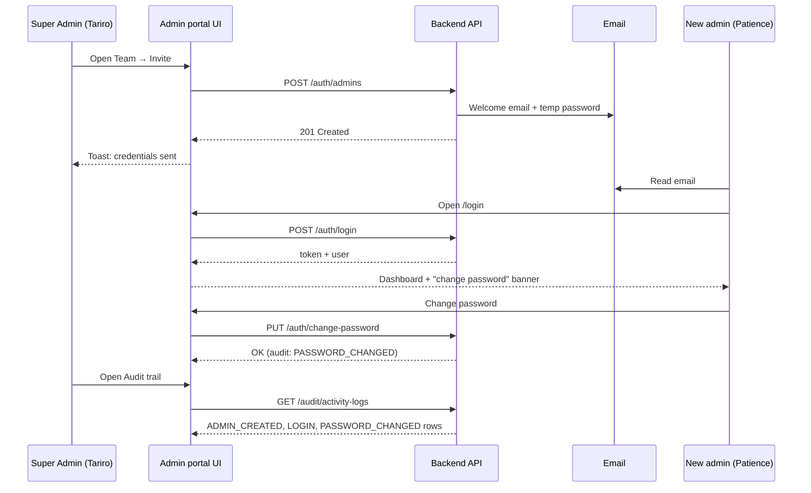

# Admin users & audit trail — frontend user stories

This document tells the **frontend agent** what to build and **why**, using user stories and step-by-step flows. APIs are described **inside** each story so you understand what happens at each moment — not as a flat endpoint list.

---

## Background: what changed and why it matters

**Before:** The admin portal often used one shared Super Admin login. Everyone signed in as the same person. The audit log could not tell *who* approved a seller or changed a setting.

**Now:** Each staff member gets their **own admin account** with their own email and password. When they log in, the server knows their `id`, `name`, and `role`. Every important action is written to an **audit trail** with that person’s identity.

**Your job as frontend:** Build screens so that:

1. Everyone uses the **same login form** (`POST /api/auth/login`) — no role toggles on the page.
2. After login, redirect by `userType` — admins go to `/dashboard/admin`.
3. The app shows **who is logged in** in the header at all times (`GET /api/auth/me` on refresh).
4. **Any admin portal user** can **invite** teammates (system emails a temporary password at `https://www.simbimarket.com/auth/login`).
5. **Super Admins only** can assign the `SUPER_ADMIN` role, suspend users, or view the audit trail.

---

## Personas

| Persona | Role | What they care about |
|---------|------|----------------------|
| **Tariro** | Super Admin | Full access; manages team, sees audit log, can invite new admins |
| **James** | FinOps Analyst | Payouts and financial screens only |
| **Rudo** | Compliance Manager | Sellers, disputes, compliance |
| **Kuda** | Logistics Coordinator | Orders dispatch, carriers, regions |
| **New hire (Patience)** | Just invited Super Admin | Received email with temp password; must log in and change password |
| **Frontend agent** | — | Builds UI that matches these flows and never leaks secrets |

---

## Global rules (read before any story)

These apply across the whole admin app:

1. **Single login form for everyone.**  
   Call `POST /api/auth/login` with `{ email, password }`. The server resolves the account type and returns `userType`.  
   For admins, require `userType === "admin"` before entering the admin app. If the same email exists as buyer and admin, the server checks **admin first** (then seller/staff, then buyer).

2. **Session refresh:** `GET /api/auth/me` with the same JWT (not `/api/admin/auth/me`).

3. **Admin features** still use `/api/admin/*` routes with the same token from unified login.

4. **The server identifies the user from the JWT.**  
   You never send `adminId` in request bodies to “say who did it.” The backend reads `req.admin.id` from the token. Your job is to keep the token on every `/api/admin/*` request.

5. **Passwords are never shown in the UI after invite.**  
   Welcome emails link to `https://www.simbimarket.com/auth/login` (configurable via `FRONTEND_URL` on the server).

6. **Sensitive fields never appear in API responses** — do not store them if they ever leak: `password`, `passwordResetToken`, `mfaSecret`.

7. **401** → session dead → clear token, go to login.  
   **403** → logged in but wrong role → show “You don’t have permission.”

**Auth header on protected calls:**

```
Authorization: Bearer <accessToken>
Content-Type: application/json
```

**API bases:**

- Auth: `{VITE_API_BASE_URL}/api/auth` (login, me, forgot/reset password)
- Admin: `{VITE_API_BASE_URL}/api/admin` (team, audit, change-password, etc.)

Example local: `http://localhost:5000` (check your server `PORT` in `.env`)

---

# Epic 1 — Sign in and know who you are

## Story 1.1 — Admin signs in with their own account

**As** any admin user  
**I want** to sign in with my work email and password  
**So that** the system knows it is me, not someone else using a shared account

### What the user sees

1. Login page at `/login` with email + password fields and “Sign in”.
2. Optional link: “Forgot password?”
3. On success → taken to the dashboard.
4. On failure → error under the form (e.g. “Invalid email or password” or “Account is suspended…”).

### What happens step by step

| Step | User action | Frontend | Backend |
|------|-------------|----------|---------|
| 1 | Opens `/login` | Show empty form | — |
| 2 | Enters email + password, submits | `POST /api/auth/login` with `{ email, password }` | Resolves admin account; checks `status === ACTIVE` |
| 3 | — | Receives `data.accessToken`, `data.userType`, `data.user` | Records `LOGIN` in audit log when `userType === "admin"` |
| 4 | — | If `userType !== "admin"`, show error or redirect to buyer/seller app | — |
| 5 | — | Saves `accessToken` | — |
| 6 | — | Redirects to `/dashboard/admin` | — |

### Response shape (success)

```json
{
  "success": true,
  "data": {
    "accessToken": "eyJ...",
    "expiresIn": "7d",
    "userType": "admin",
    "user": {
      "id": "uuid",
      "email": "tariro@simbimarket.com",
      "firstName": "Tariro",
      "lastName": "Moyo",
      "role": "SUPER_ADMIN",
      "status": "ACTIVE",
      "mustChangePassword": false
    }
  }
}
```

Use `data.user` for the session. `user.role` is the admin RBAC role (`SUPER_ADMIN`, etc.) — not the string `"admin"` (that is `userType`).

### Acceptance criteria

- [ ] Login form calls `POST /api/auth/login` only (no separate admin login URL in the UI).
- [ ] Admin app only proceeds when `userType === "admin"`.
- [ ] Successful login stores JWT and user profile.
- [ ] Failed login shows server `message` without clearing previous session incorrectly.
- [ ] Suspended/inactive accounts cannot proceed (401 with message).

### Edge case — email exists as buyer too

Tariro’s email might also be a buyer account. That does **not** matter here — admin login only looks at the `admins` table. Do not try to “pick” user type on login; use admin endpoint only.

---

## Story 1.2 — App shows who is logged in

**As** any signed-in admin  
**I want** to see my name, email, and role in the header  
**So that** I always know which account I’m using (especially after we stopped sharing logins)

### What the user sees

Top bar example:

```
Tariro Moyo  ·  tariro@simbimarket.com  ·  Super Admin     [▼ Account]
```

Account dropdown:

- Change password
- Sign out

### What happens step by step

| Step | When | Frontend | Backend |
|------|------|----------|---------|
| 1 | User opens app with token already saved | Call `GET /api/auth/me` with Bearer token | Returns `userType: "admin"` + admin profile |
| 2 | — | Render `firstName`, `lastName`, `email`, friendly role label | — |
| 3 | Token invalid/expired | 401 → clear storage → redirect `/login` | — |

### Role → display label

| `role` value | Show in UI |
|--------------|------------|
| `SUPER_ADMIN` | Super Admin |
| `FINOPS_ANALYST` | FinOps |
| `COMPLIANCE_MANAGER` | Compliance |
| `LOGISTICS_COORDINATOR` | Logistics |
| `TECH_SUPPORT` | Tech Support |

### Acceptance criteria

- [ ] On every protected page load, session is validated via `/auth/me` (or trusted cached profile refreshed on app boot).
- [ ] Header always visible when authenticated.
- [ ] Profile response never displays password or reset tokens.

---

## Story 1.3 — Admin signs out

**As** any admin  
**I want** to sign out  
**So that** the next person using this device cannot access my session

### Flow

1. User clicks “Sign out”.
2. Frontend removes token and user from storage.
3. Redirect to `/login`.
4. No API call required (JWT is stateless).

---

## Story 1.4 — Admin forgot password

**As** an admin who forgot my password  
**I want** to receive a reset link by email  
**So that** I can set a new password and sign in again

### What the user sees

1. `/forgot-password` — email field, “Send reset link”.
2. Success message: “If an account exists, we sent a link” (do not reveal whether email exists).
3. Email contains link to `/reset-password?token=...`.
4. Reset page — new password + confirm → “Password updated” → link to login.

### What happens step by step

| Step | Page | API | Body |
|------|------|-----|------|
| 1 | Forgot | `POST /api/auth/forgot-password` | `{ "email": "...", "userType": "admin" }` |
| 2 | Reset | `POST /api/auth/reset-password` | `{ "token": "...", "newPassword": "..." }` |
| 3 | Done | Redirect to `/login` | User must use **admin** login again |

**Note:** Forgot/reset live under `/api/auth`. After reset, sign in again via **`POST /api/auth/login`**.

### Acceptance criteria

- [ ] `userType: "admin"` sent on forgot-password so email targets admin record.
- [ ] After reset, login page uses admin endpoint only.

---

## Story 1.5 — Admin changes password while logged in

**As** any signed-in admin  
**I want** to change my password  
**So that** I replace a temporary or weak password with my own

### What the user sees

- Form: current password, new password, confirm new password.
- Success toast: “Password changed.”
- Especially important for **invited users** (see Story 2.2): show a prominent banner on first login: *“You’re using a temporary password. Change it now.”*

### What happens

1. User submits form.
2. Frontend validates: new ≥ 8 chars, confirm matches.
3. `PUT /api/admin/settings/change-password` with `{ currentPassword, newPassword }` (alias: `PUT /api/admin/auth/change-password`).
4. Server records `PASSWORD_CHANGED` in audit log for this user’s `id`.
5. Show success; optionally dismiss first-login banner.

### Acceptance criteria

- [ ] Wrong current password shows server error.
- [ ] Success does not log the user out automatically (unless you choose to for security).

---

# Epic 2 — Admin team management

*Any authenticated admin portal user (`SUPER_ADMIN`, `FINOPS_ANALYST`, etc.) can open **Settings → Team**, list admins, and invite new users.*

*Restrictions:*
- Only **Super Admin** can assign role `SUPER_ADMIN` on invite.
- Only **Super Admin** can edit/suspend admins (`PUT /api/admin/auth/admins/:id`).

## Story 2.1 — Super Admin sees everyone on the team

**As** Tariro (Super Admin)  
**I want** a list of all admin users  
**So that** I know who has access and what role they have

### What the user sees

Page: **Settings → Team** (`/settings/team`)

Table columns:

| Name | Email | Role | Status | Last login | Actions |
|------|-------|------|--------|------------|---------|
| Tariro Moyo | tariro@… | Super Admin | Active | 26 May, 09:00 | Edit |
| James N. | james@… | FinOps | Active | 25 May, 14:22 | Edit · Suspend |

- Button top-right: **Invite admin**
- Status badges: Active (green), Suspended (red), Inactive (gray)
- Empty state: “No admins yet” + Invite CTA

### What happens

1. Page loads → `GET /api/admin/auth/admins` with Bearer token.
2. Server returns array of profiles (no passwords, no reset tokens).
3. Render table; sort by name or last login client-side if desired.

### Acceptance criteria

- [ ] Any admin portal role can open Team and call `GET /api/admin/auth/admins`.
- [ ] Last login shows “Never” when `lastLoginAt` is null.

---

## Story 2.2 — Admin invites a new teammate

**As** Tariro (Super Admin) or Patience (invited Super Admin)  
**I want** to invite Patience by email  
**So that** she gets her own login without me choosing or sending a password manually

### What the user sees (inviter)

1. Clicks **Invite admin** → modal opens.
2. Fields: Email, First name, Last name, Role (dropdown, default **Super Admin** if she needs same privileges).
3. **There is no password field** — copy in the modal: *“A temporary password will be emailed to this address.”*
4. Submit → loading → success toast: **“Admin created; credentials sent by email.”**
5. Modal closes; table refreshes; Patience appears as Active.

### What the user sees (invitee — Patience)

1. Receives email: login URL **`https://www.simbimarket.com/auth/login`**, her email, temporary password, note to change password after first login.
2. Opens that URL (same unified login as everyone), signs in with emailed password.
3. Sees first-login banner → changes password (Story 1.5).

### What happens step by step

| Step | Actor | Frontend | Backend |
|------|-------|----------|---------|
| 1 | Tariro | Opens invite modal | — |
| 2 | Tariro | `POST /api/admin/auth/admins` `{ email, firstName, lastName, role }` | Generates secure password, creates `admins` row |
| 3 | — | — | Sends welcome email with temp password |
| 4 | — | — | If email fails → **rolls back** user → returns **502** |
| 5 | — | — | If success → audit: `ADMIN_CREATED` attributed to **Tariro’s** id |
| 6 | Patience | `POST /api/auth/login` → `userType: "admin"` | Audit: `LOGIN` attributed to **Patience’s** id |

Two different people → two different audit rows. That is the point.

### Allowed roles in dropdown

Only portal roles (reject buyer/seller roles):

- Super Admin
- FinOps
- Compliance
- Logistics
- Tech Support

### Error stories

| Situation | HTTP | What to show |
|-----------|------|----------------|
| Email already an admin | 409 | “This email is already registered as an admin.” |
| Invalid role / validation | 400 | Server `message` |
| Email service down | 502 | “Could not send welcome email. No account was created. Try again or contact support.” |
| Non–Super Admin invites `SUPER_ADMIN` role | 400 | “Only Super Admins can invite users with the Super Admin role” |

### Acceptance criteria

- [ ] Invite form has no password input.
- [ ] Default role is `SUPER_ADMIN` when inviter wants equal privileges (Super Admin inviter only).
- [ ] Non–Super Admin inviters can invite FinOps, Compliance, Logistics, Tech Support — not Super Admin.
- [ ] 502 does not add a row to the table (account rolled back).
- [ ] Invited user signs in via unified `POST /api/auth/login`.

---

## Story 2.3 — Super Admin updates a teammate’s role or name

**As** Tariro  
**I want** to change James from FinOps to Compliance (or fix a typo in his name)  
**So that** his access matches his job without creating a new account

### What the user sees

1. Clicks **Edit** on a row → drawer/side panel.
2. Editable: First name, Last name, Role (dropdown), Status (dropdown).
3. Save → “Admin updated successfully” → table row updates.

### What happens

1. `PUT /api/admin/auth/admins/:id` with only changed fields, e.g. `{ "role": "COMPLIANCE_MANAGER" }`.
2. Server writes audit `ADMIN_UPDATED` with Tariro as actor and metadata about what changed.
3. James’s next request still uses same JWT until expiry, but his **role in token may be stale** until he logs in again — optional: show “Role changes take effect on next login” if you decode JWT client-side.

### Acceptance criteria

- [ ] At least one field required on save.
- [ ] Cannot set buyer/seller roles in dropdown.

---

## Story 2.4 — Super Admin suspends someone

**As** Tariro  
**I want** to suspend a former employee’s admin account  
**So that** they can no longer sign in

### What the user sees

1. Edit panel → Status → **Suspended** (or Inactive).
2. Confirmation dialog: *“Suspend james@…? They will not be able to sign in.”*
3. Save → status badge turns red.

### What happens

1. `PUT /api/admin/auth/admins/:id` with `{ "status": "SUSPENDED" }`.
2. Server audit: `ADMIN_SUSPENDED`.
3. If James tries to login → 401 “Account is suspended…”

### Guard story — cannot remove the last Super Admin

**As** the system  
**I want** to block suspending or demoting the last active Super Admin  
**So that** the organization is never locked out of admin entirely

| Attempt | Result |
|---------|--------|
| Suspend the only active Super Admin | 400 — show server message about last Super Admin |
| Demote self from Super Admin when no other active Super Admin exists | 400 — same |
| Demote/suspend when another active Super Admin exists | Success |

Frontend: show the server `message` verbatim in a dialog; do not genericize it.

---

# Epic 3 — Super Admin reviews the audit trail

## Story 3.1 — Super Admin opens the activity log

**As** Tariro  
**I want** a chronological list of important admin actions  
**So that** I can answer “who approved this seller?” or “who changed pricing?”

### What the user sees

Page: **Settings → Audit trail** (`/settings/audit`)

- Filter bar: date from / to, **Admin** (dropdown of team members), **Action type** (dropdown), optional entity type.
- Timeline or table, newest first:

```
26 May 2026, 11:04   Tariro Moyo          Invited admin          Admin · uuid-…
26 May 2026, 11:10   Patience Chikwanha   Signed in              Admin · her-id
26 May 2026, 11:15   Patience Chikwanha   Changed password       Admin · her-id
26 May 2026, 14:00   James N.             Recorded payout        Seller · seller-id
```

- Expandable row for `metadata` (JSON details).
- Pagination at bottom: “Page 1 of 8”.

### What happens

1. Load admins list for filter dropdown: `GET /api/admin/auth/admins`.
2. Load logs: `GET /api/admin/audit/activity-logs?page=1&limit=20` (+ filters).
3. Map `action` codes to human labels (table below).
4. For each row, show `admin.firstName` + `admin.lastName`; subtitle `admin.email`.

### Human-readable action labels

| Server `action` | Show in UI |
|-----------------|------------|
| `LOGIN` | Signed in |
| `PASSWORD_CHANGED` | Changed password |
| `ADMIN_CREATED` | Invited admin |
| `ADMIN_UPDATED` | Updated admin |
| `ADMIN_SUSPENDED` | Suspended admin |
| `SETTINGS_UPDATED` | Updated settings |
| `SELLER_APPROVED` | Approved seller |
| `SELLER_UPDATED` | Updated seller |
| `ORDER_DISPATCHED` | Dispatched order |
| `ORDER_STATUS_CHANGED` | Changed order status |
| `PAYOUT_RECORDED` | Recorded payout |
| `CARRIER_CREATED` | Created carrier |
| `CARRIER_UPDATED` | Updated carrier |
| `REGION_CREATED` | Created region |
| `REGION_UPDATED` | Updated region |
| `MATRIX_UPDATED` | Updated shipping matrix |
| `DISPUTE_ASSIGNED` | Assigned dispute |
| `DISPUTE_RESOLVED` | Resolved dispute |
| `HTTP_MUTATION` | API change (`method` + `path` from metadata) |

### Example log item

```json
{
  "id": "log-uuid",
  "admin": {
    "firstName": "Tariro",
    "lastName": "Moyo",
    "email": "tariro@simbimarket.com",
    "role": "SUPER_ADMIN"
  },
  "action": "SELLER_APPROVED",
  "entityType": "Seller",
  "entityId": "seller-uuid",
  "metadata": {},
  "ipAddress": "203.0.113.1",
  "createdAt": "2026-05-26T14:00:00.000Z"
}
```

If you have a seller detail route, link `entityId` when `entityType === "Seller"`.

### Acceptance criteria

- [ ] Only Super Admin sees Audit in nav.
- [ ] Filters refetch with query params (`adminId`, `action`, `from`, `to`).
- [ ] Pagination uses `data.pagination.totalPages`.
- [ ] Empty state: “No activity for these filters.”

---

## Story 3.2 — Investigating a specific person’s actions

**As** Tariro  
**I want** to filter the audit log to one admin  
**So that** I can review everything Patience did this week

### Flow

1. Open Audit trail.
2. Set **Admin** filter → Patience Chikwanha (`adminId` = her uuid).
3. Set date range → this week.
4. Table shows only her `LOGIN`, `PASSWORD_CHANGED`, etc.

API: `GET /api/admin/audit/activity-logs?adminId={uuid}&from=2026-05-20&to=2026-05-26`

---

# Epic 4 — Navigation by role

## Story 4.1 — Each role only sees menus they’re allowed to use

**As** James (FinOps)  
**I want** to see payouts and dashboard, and invite teammates (non–Super Admin roles), but not Audit  
**So that** the app matches what I’m allowed to do

### Menu visibility (hide items; server still enforces 403)

| Menu / area | Super Admin | FinOps | Compliance | Logistics | Tech Support |
|-------------|:-----------:|:------:|:----------:|:-----------:|:------------:|
| Dashboard | ✓ | ✓ | ✓ | ✓ | ✓ |
| Team (list + invite) | ✓ | ✓ | ✓ | ✓ | ✓ |
| Audit trail | ✓ | — | — | — | — |
| Payouts / Financial | ✓ | ✓ | — | — | — |
| Sellers / Disputes | ✓ | — | ✓ | — | — |
| Logistics / Carriers | ✓ | — | — | ✓ | — |
| Support / Users | ✓ | — | — | — | ✓ |

Read `user.role` from session after login. Gate routes client-side **and** handle 403 from API gracefully.

### Acceptance criteria

- [ ] Any admin portal role can open Team and invite (except assigning `SUPER_ADMIN` unless inviter is Super Admin).
- [ ] Only Super Admin sees Audit in nav.

---

# End-to-end journey (putting it all together)



---

# Page map (for routing)

```
/login
/forgot-password
/reset-password?token=...

/app (authenticated layout)
  /dashboard
  /settings
    /password     ← Story 1.5 (any admin)
    /team         ← Epic 2 (any admin portal user; invite + list)
    /audit        ← Epic 3 (Super Admin only)
```

---

# Appendix A — TypeScript types

```typescript
export type AdminRole =
  | "SUPER_ADMIN"
  | "FINOPS_ANALYST"
  | "COMPLIANCE_MANAGER"
  | "LOGISTICS_COORDINATOR"
  | "TECH_SUPPORT";

export type UserStatus = "ACTIVE" | "INACTIVE" | "SUSPENDED";

export interface AdminProfile {
  id: string;
  email: string;
  firstName: string;
  lastName: string;
  role: AdminRole;
  status: UserStatus;
  mfaEnabled: boolean;
  lastLoginAt: string | null;
  lastLoginIp: string | null;
  createdAt: string;
  updatedAt: string;
}
```

---

# Appendix B — API quick reference (secondary)

Use this **after** reading the stories above.

| Story | Method | Path |
|-------|--------|------|
| 1.1 Login | POST | `/api/auth/login` |
| 1.2 Session | GET | `/api/auth/me` |
| 1.4 Forgot | POST | `/api/auth/forgot-password` |
| 1.4 Reset | POST | `/api/auth/reset-password` |
| 1.5 Change password | PUT | `/api/admin/settings/change-password` |
| 2.1 List team | GET | `/api/admin/auth/admins` |
| 2.2 Invite | POST | `/api/admin/auth/admins` |
| 2.3 / 2.4 Update | PUT | `/api/admin/auth/admins/:id` |
| 3.1 Audit | GET | `/api/admin/audit/activity-logs` |

---

# Appendix C — Frontend agent checklist

Before marking done, verify each story:

- [ ] **1.1** Login uses `POST /api/auth/login`; JWT stored when `userType === "admin"`.
- [ ] **1.2** Header shows name, email, role from `GET /api/auth/me`.
- [ ] **1.4** Forgot/reset works for `userType: "admin"`.
- [ ] **1.5** Settings → Password uses `PUT /api/admin/settings/change-password`; first-login banner for invited users. See [ADMIN_SETTINGS_CHANGE_PASSWORD_FRONTEND.md](./ADMIN_SETTINGS_CHANGE_PASSWORD_FRONTEND.md).
- [ ] **2.1** Team table loads for any admin portal user.
- [ ] **2.2** Invite has no password field; handles 502, 409, and Super Admin role guard.
- [ ] **2.3** Edit admin saves role/name changes.
- [ ] **2.4** Suspend shows guard error for last Super Admin.
- [ ] **3.1** Audit timeline with filters and pagination.
- [ ] **4.1** Menus hidden per role; 403 handled.

**Env:** `VITE_API_BASE_URL=http://localhost:5000` (your API host, no `/api` suffix; match server `PORT`).
